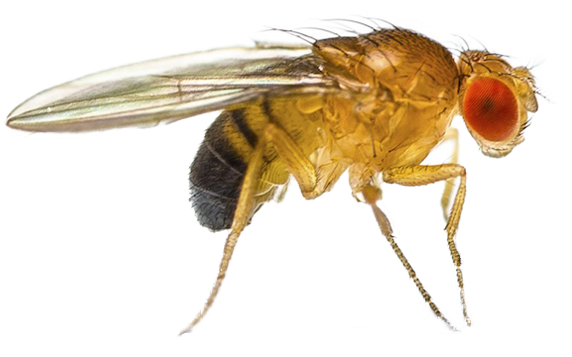
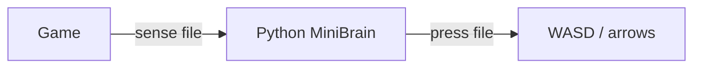

<p align="center">
  
</p>

<h1 align="center">Fruit Fly FNF</h1>

<p align="center">
  A <a href="https://github.com/natverse/malecns">male-cns</a> mushroom-body circuit that plays Friday Night Funkin’.<br>
  Not botplay. A 1000-cell fly brain in a Python window.
</p>

<p align="center">
  
  
  
  
</p>

Copy **one** engine pack from [`copy-to-game/`](copy-to-game/). Mixing Psych, V-Slice, and Codename files in the same `mods/fruit-fly` folder will break the game.

## Features

| | What it does |
| :---: | --- |
| 🧠 | 1000-cell MiniBrain (289 [male-cns](https://github.com/natverse/malecns) cells + 711 association cells) |
| 🎯 | Hits normal purple / blue / green / red notes and holds every sustain |
| 🚫 | Skips black, hurt, mine, and similar notes |
| 🪟 | `START FLY BRAIN` for Windows, Linux, and macOS |

## Contents

- [Install](#install)
- [Start the brain](#start-the-brain)
- [What it hits](#what-it-hits)
- [How it works](#how-it-works)
- [License](#license)

## Install

1. Install [Python 3](https://www.python.org/downloads/). On Windows, tick **Add python.exe to PATH**.
2. Once, in a terminal:

```bash
python -m pip install numpy opencv-python
```

If `python` is not found, use `python3` instead.

3. Delete any old `mods/fruit-fly`, then copy **one** folder:

| Engine | Copy this | Into |
| --- | --- | --- |
| Psych | [`copy-to-game/psych/mods/fruit-fly`](copy-to-game/psych/mods/fruit-fly) | `<Psych>/mods/fruit-fly` |
| V-Slice | [`copy-to-game/vslice/mods/fruit-fly`](copy-to-game/vslice/mods/fruit-fly) | `<Funkin>/mods/fruit-fly` |
| Codename | [`copy-to-game/codename/mods/fruit-fly`](copy-to-game/codename/mods/fruit-fly) | `<Codename>/mods/fruit-fly` |

Enable the pack. Turn **Botplay / CPU / Autobot** off.

| OS | Typical `mods/` location |
| --- | --- |
| Windows | Next to the `.exe` |
| Linux | Next to the game binary |
| macOS | Next to `Funkin.app`, or `Funkin.app/Contents/Resources/mods/fruit-fly` |

## Start the brain

A window titled **Fly brain** must stay open while you play. After it appears, click the **game** so the game has focus.

Each pack already has these files in the `fruit-fly` folder:

| OS | Start | Stop |
| --- | --- | --- |
| Windows | Double-click `START FLY BRAIN.bat` | `STOP FLY BRAIN.bat`, or close the window |
| Linux | `chmod +x "START FLY BRAIN.sh"` then `./START FLY BRAIN.sh` | `STOP FLY BRAIN.sh` |
| macOS | Double-click `START FLY BRAIN.command` | close the window, Esc, or Q |

On macOS, if Gatekeeper blocks the file: right-click → **Open** → **Open**. If it still will not run:

```bash
chmod +x "START FLY BRAIN.command"
```

You can also stop the brain with the window **X**, **Esc**, or **Q**.

> **V-Slice** cannot launch Python from a mod. Always start the brain with the files above before a song.
>
> **Psych** and **Codename** try to open it when a song starts. If the window does not appear, start it by hand the same way.

Linux key sending (Psych): install `xdotool` on X11, or `ydotool` on Wayland, if arrows / WASD never reach the game.

macOS key sending (Psych): System Settings → Privacy & Security → Accessibility → allow Terminal or Python.

## What it hits

The fly plays **Boyfriend** notes only:

- Hits the normal purple / blue / green / red notes
- Holds every sustain for the full trail
- Skips black, hurt, mine, and similar notes

It is a 1000-cell circuit (289 male-cns cells plus 711 association cells), not engine Autobot.

## How it works



The game writes approaching notes to `fly_fnf_sense.txt`. Python steps the circuit and writes presses to `fly_fnf_press.txt` only when a lane should fire.

Circuit: Janelia FlyEM **male-cns:v1.0** via [natverse/malecns](https://github.com/natverse/malecns) (CC-BY). Do not ship FNF songs or Funkin’ Crew art.

```
copy-to-game/psych/mods/fruit-fly     Psych
copy-to-game/vslice/mods/fruit-fly    V-Slice
copy-to-game/codename/mods/fruit-fly  Codename
```

## License

Code is [MIT](LICENSE). Circuit data is CC-BY via [natverse/malecns](https://github.com/natverse/malecns) (Janelia FlyEM male-cns).
